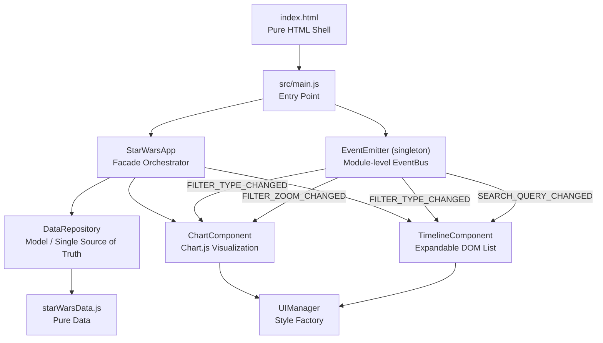

# Jedi Archive: Holocron Data

> Explore the Star Wars canon through an interactive galactic timeline.


**Where the Force meets clean code.**

🌐 **Live:** [kalyelnlaurindo.github.io/HolocronData](https://kalyelnlaurindo.github.io/HolocronData/)

Jedi Archive is an interactive web application built with modular Vanilla JS and Vite, designed to explore the entire canonical Star Wars timeline — movies, live-action series, and animations — with a focus on componentization, OOP design patterns (Observer, Repository, Facade), and a premium visual experience featuring glassmorphism and fluid animations.

---

## 📋 Table of Contents

1. [Overview](#-overview)
2. [Requirements](#-requirements)
3. [Architecture](#-architecture)
4. [Design (UI/UX)](#-design-uiux)
5. [Test Plan](#-test-plan)
6. [Project Management](#-project-management)
7. [Code Structure](#-code-structure)
8. [API & Integrations](#-api--integrations)
9. [Deployment](#-deployment)
10. [Security & Observability](#-security--observability)
11. [Roadmap](#-roadmap)
12. [Contributing](#-contributing)
13. [Appendices](#-appendices)

---

## 🎯 Overview

### Context & Problem

The Star Wars canonical universe spans over 40 works — movies, live-action series, and animations — distributed across a timeline of more than 260 galactic years. Fans and newcomers alike struggle to understand the correct chronological order, mainly because the release order of the works diverges significantly from the in-universe event order.

Additionally, the project was born from a technical challenge: transforming a static, monolithic HTML file (~723 lines) into a modular, scalable architecture with clear separation of concerns — applying Clean Code and real design patterns in Vanilla JS.

### Objectives

**Primary Objective:**
Provide users with an interactive, visually immersive, and educational interface to explore the canonical Star Wars timeline, with dynamic filters, real-time search, and expandable details per work.

**Secondary Objectives:**
- Demonstrate the application of OOP patterns (Observer, Repository, Facade) in pure Vanilla JS without UI frameworks
- Achieve a modular architecture with native ES Modules, served via Vite
- Ensure DOM manipulation performance using node caching and Event Delegation
- Serve as a best-practices reference for Vanilla JS Frontend projects

### Scope

**In scope (the project WILL do):**
- Scatter chart visualization with zoom by historical Era (via Chart.js)
- Expandable list with animated accordion (CSS Grid trick)
- Combined filters by Media Type and debounced text search
- Progressive rendering with staggered entry animations
- Modular architecture with barrel exports and dependency injection

**Out of scope (the project will NOT do):**
- Backend or own API (data resides in `starWarsData.js`)
- Authentication or user profiles
- Support for Expanded Universe (Legends) content
- Native mobile application

### Target Audience

Star Wars fans of all levels who want to understand the canonical timeline, and Frontend developers interested in modular Vanilla JS architectures with applied design patterns.

---

## 📋 Requirements

### Functional Requirements (FR)

| ID    | Description                                                                                         | Priority |
|-------|-----------------------------------------------------------------------------------------------------|----------|
| FR001 | The system must display all canonical works in a chronological scatter chart                        | `High`   |
| FR002 | The system must allow filtering the chart by historical Era (X-axis zoom)                           | `High`   |
| FR003 | The system must display the list of works in chronological order with an expandable accordion       | `High`   |
| FR004 | The system must filter the list by Media Type (Movie, Live-action, Animation)                       | `High`   |
| FR005 | The system must filter the list by title text search with a 200ms debounce                          | `High`   |
| FR006 | The system must display full details (duration, release date, IMDb, trivia) when expanding a card  | `Medium` |
| FR007 | The system must automatically collapse expanded cards when opening a new one                        | `Medium` |
| FR008 | The system must display an empty state message when no filter returns results                        | `Low`    |

### Non-Functional Requirements (NFR)

| ID     | Category            | Description                                                                                  |
|--------|---------------------|----------------------------------------------------------------------------------------------|
| NFR001 | **Performance**     | Filters must respond in < 16ms (1 frame at 60fps) using cached DOM nodes                    |
| NFR002 | **Maintainability** | Each module must have a single responsibility (SRP); adding works requires editing only `starWarsData.js` |
| NFR003 | **Usability**       | Responsive interface for desktop and tablets; keyboard control on the search field           |
| NFR004 | **Compatibility**   | Support for modern browsers with ES Module support (Chrome 80+, Firefox 75+, Safari 14+)    |
| NFR005 | **Build**           | Production bundle must be generated in < 1s via Vite                                         |

---

## 🏗️ Architecture

### Architecture Overview



### Architectural Decision Records (ADRs)

| ADR   | Decision                                        | Rationale                                                                                        |
|-------|-------------------------------------------------|--------------------------------------------------------------------------------------------------|
| ADR01 | Vanilla JS with ES Modules + Vite               | The original code already used OOP classes; adding a framework would be over-engineering for this scope |
| ADR02 | Observer/EventBus as module-level singleton     | `EventBus` is instantiated in `StarWarsApp.js` module scope (not as a class member), decoupling all Views via Pub/Sub |
| ADR03 | DOM node cache in `this.domNodes`               | Avoids costly re-renders; filters toggle `hidden` in O(1) per cached node                       |
| ADR04 | Event Delegation on the list container          | A single listener on the parent captures all clicks, preventing O(N) memory leaks               |
| ADR05 | Data in a pure declarative JS module            | Allows future swap with an API call without changing any View component                          |
| ADR06 | Barrel exports (`index.js`) in each component   | Stable public interface; internals can be refactored without breaking importers. **Exception:** `UIManager` is imported directly (no barrel), as it is a stateless utility with no internal complexity to hide |
| ADR07 | Tailwind CSS via PostCSS (not CDN)              | CDN version is banned in production (no tree-shaking, no JIT cache); PostCSS pipeline via `tailwind.config.js` generates only the used classes, reducing CSS bundle size |

### Technology Stack

| Category           | Technology                          | Purpose / Rationale                                               |
|--------------------|-------------------------------------|-------------------------------------------------------------------|
| **Language**       | JavaScript ES2022                   | Native classes, ES Modules, template literals, destructuring      |
| **Build Tool**     | Vite 5.2+ (5.4.21 tested)           | Instant HMR, optimized bundling, native ES Module support         |
| **Visualization**  | Chart.js (via CDN)                  | Scatter plot with custom tooltips and declarative animations      |
| **Styling**        | Tailwind CSS 3.x (PostCSS) + custom CSS | Tree-shaken utility classes via `tailwind.config.js`; design tokens in `global.css` |
| **Typography**     | Google Fonts (Outfit)               | Premium readability in a dark context                             |
| **CSS Processing** | PostCSS + Autoprefixer              | Vendor prefix automation; Tailwind compilation pipeline           |
| **PWA**            | Web App Manifest                    | Installable app, `theme-color`, offline icon, iOS meta tags       |
| **Runtime**        | Modern browser                      | No backend dependency; 100% client-side                           |

### Applied Design Patterns

| Pattern       | Class / Module       | Responsibility                                              |
|---------------|----------------------|-------------------------------------------------------------|
| **Repository**| `DataRepository`     | Isolates and validates the data source; single access point |
| **Observer**  | `EventEmitter`       | Decoupled Pub/Sub between View components                   |
| **Facade**    | `StarWarsApp`        | Orchestrates system instantiation and initialization        |
| **Factory**   | `UIManager`          | Maps media types to Tailwind visual tokens                  |
| **Delegation**| `TimelineComponent`  | Single listener on the container for all child cards        |

---

## 🎨 Design (UI/UX)

### Style Guide

- **Color Palette:**
  | Token        | Value       | Usage                             |
  |--------------|-------------|-----------------------------------|
  | Background   | `#020617`   | Main background (slate-950)       |
  | Surface Glass| `rgba(30, 41, 59, 0.45)` | Glassmorphism panels   |
  | Primary      | `#38bdf8`   | Jedi accent / holograms           |
  | Secondary    | `#f43f5e`   | Sith / Empire accent              |
  | Tertiary     | `#c084fc`   | Animations / magical elements     |
  | Movie        | `#eab308`   | Movie badge (yellow)              |
  | Live-action  | `#0ea5e9`   | Live-action series badge          |
  | Animation    | `#a855f7`   | Animation badge                   |

- **Typography:**
  Family: `Outfit` (Google Fonts) | Weights: 300, 400, 500, 600, 700, 800

- **Main Visual Effect:** Glassmorphism (`backdrop-filter: blur`) with ambient light orbs in the background

- **Animations:**
  - Card entry: `slideUp` with staggered delay by index
  - Accordion: CSS Grid `grid-template-rows: 0fr → 1fr` with `cubic-bezier(0.4, 0, 0.2, 1)`
  - Card hover: `translateY(-2px)` with smooth 300ms transition

### Accessibility Guidelines

- Search field with descriptive placeholder and keyboard navigation support
- Contrast ensured through calibrated opacity suffixes on the dark background
- Icons used as decorative elements (chevron SVG as visual state indicator)

---

## 🧪 Test Plan

### Testing Strategy

| Test Type        | Suggested Tool  | Target Coverage                                                                    |
|------------------|-----------------|------------------------------------------------------------------------------------|
| Unit             | Vitest          | `DataRepository._validate()`, `UIManager.getStyle()`, `EventEmitter.on/emit()`    |
| Unit (template)  | Vitest + jsdom  | `TimelineComponent._buildCardTemplate()` — verify correct HTML output per type    |
| Integration      | Vitest + jsdom  | Filter flow → EventBus → DOM node `hidden` class toggle                            |
| End-to-end (E2E) | Playwright      | Title search, card expansion, Era zoom                                             |

### Priority Test Scenarios

| ID     | Type        | Scenario                                                                    | Expected Result                                               |
|--------|-------------|-----------------------------------------------------------------------------|---------------------------------------------------------------|
| TC-001 | Unit        | `new DataRepository()._validate([])` — empty array                          | Logs `WARN` without throwing; `_data` remains `[]`            |
| TC-002 | Unit        | `new DataRepository()._validate("string")` — non-array                     | Throws `Error`: *"A fonte de dados matriz não obedece..."*     |
| TC-003 | Unit        | `UIManager.getStyle("Série Live-action")` — substring match on 'Live-action'| Returns `{ color: '#0ea5e9', bg: 'bg-sky-500/10', ... }`     |
| TC-004 | Unit        | `new EventEmitter().emit('NO_LISTENER')` — no listeners registered          | Logs `WARN` without throwing                                  |
| TC-005 | Unit        | `TimelineComponent._buildCardTemplate(filmItem, filmStyle)`                 | Returns HTML string containing `text-yellow-400` badge class  |
| TC-006 | Integration | Emit `FILTER_TYPE_CHANGED` with `"Filme"` after `render()`                  | Only nodes with type `"Filme"` lack `hidden` class            |
| TC-007 | Integration | Emit `SEARCH_QUERY_CHANGED` with `"Andor"` after `render()`                 | Only nodes with "Andor" in title lack `hidden` class          |
| TC-008 | E2E         | Click "Alta República" button                                               | Chart X axis updates to range `[-250, -80]`                   |
| TC-009 | E2E         | Click card → verify expansion → click another card                          | First card collapses before second opens (accordion behavior) |

---

## 📌 Project Management

### Methodology & Tools

- **Methodology:** Solo development focused on refactoring (Clean Code + progressive Design Patterns)
- **Version control:** Git + GitHub

### Prioritization (Impact vs. Complexity Matrix)

|                    | **Low Complexity**                           | **High Complexity**                                    |
|--------------------|----------------------------------------------|--------------------------------------------------------|
| **High Impact**    | **Quick Wins:** Filters, search, accordion   | **Plan Carefully:** Migrate to TypeScript, add tests   |
| **Low Impact**     | **Consider Later:** Extra decorative anims   | **Avoid:** SSR, own backend                            |

### High-Level Roadmap

- **Q2 2026:** v1.0 — Complete modular refactoring with Vite, all patterns applied
- **Q3 2026:** v1.1 — Test coverage with Vitest + Playwright, TypeScript migration
- **Q4 2026:** v2.0 — Favorites system with `localStorage`, Era filter in the list, offline PWA

---

## 📁 Code Structure

```
StarWarsOrdem/
├── index.html                          # Pure HTML shell (no inline logic, no CDN scripts)
├── vite.config.js                      # Vite config + base: '/HolocronData/' for GitHub Pages
├── tailwind.config.js                  # Tailwind 3.x config (content scan, custom tokens, dark mode)
├── postcss.config.js                   # PostCSS pipeline: tailwindcss + autoprefixer
├── package.json                        # Scripts: dev, build, preview, deploy
├── package-lock.json                   # Lockfile (auto-generated by npm)
├── public/
│   ├── manifest.json                   # PWA Web App Manifest (icons, theme, start_url)
│   └── icons/
│       ├── icon-192x192.png            # PWA icon (maskable)
│       └── icon-512x512.png            # PWA icon large (maskable)
├── dist/                               # Production build (generated by Vite — not committed)
└── src/
    ├── main.js                         # Entry point: application bootstrapper
    ├── styles/
    │   └── global.css                  # @tailwind directives + design tokens + glassmorphism + animations
    ├── data/
    │   └── starWarsData.js             # Single source of truth for data (~40 works)
    ├── core/
    │   ├── Logger.js                   # Logging utility with namespace and colors
    │   └── EventEmitter.js             # Observer pattern (Publish/Subscribe)
    └── components/
        ├── UIManager/
        │   └── UIManager.js            # Visual token factory by media type (no barrel — imported directly)
        ├── DataRepository/
        │   ├── DataRepository.js       # Model: loads, validates and exposes data
        │   └── index.js                # Public barrel export
        ├── ChartComponent/
        │   ├── ChartComponent.js       # Chart.js scatter plot + EventBus listeners
        │   └── index.js
        ├── TimelineComponent/
        │   ├── TimelineComponent.js    # Expandable list, DOM cache, Event Delegation
        │   └── index.js
        └── StarWarsApp/
            ├── StarWarsApp.js          # Facade: orchestrates instantiation and UI controls; defines module-level EventBus singleton
            └── index.js
```

---

## 📡 API & Integrations

### Data (Client-side)

There is no REST API. Data resides in the `src/data/starWarsData.js` module and is accessed exclusively via `DataRepository`. To add works to the Holocron, edit only this file following the `StarWarsEntry` contract:

```js
{
  title: string,       // Work title
  type: string,        // ⚠️ PT-BR keys: "Filme" | "Série Live-action" | "Série de Animação" | "Animação"
                       // These strings are intentional — UIManager and filter buttons use them as matching keys.
                       // Changing them requires updating UIManager.js and index.html filter buttons simultaneously.
  time: string,        // Human-readable period (e.g. "32 BBY")
  year: number,        // Numeric year for the chart (negative = BBY, positive = ABY)
  duration: string,    // Approximate duration
  releaseDate: string, // Real-world release date
  imdb: string,        // IMDb rating or "N/A"
  context: string,     // Synopsis / narrative context
  trivia: string       // Fun fact (Holocron Trivia)
}
```

> **⚠️ Localization note:** The `type` field values and the UI labels in `index.html` (filter buttons, card labels) are in **Portuguese (pt-BR)**. The app's `lang` attribute is `pt-BR`. Full English localization would require updating `starWarsData.js` type values, `UIManager.js` style keys, `index.html` button labels, and all template strings in `TimelineComponent._buildCardTemplate()`.

### External Libraries

| Library      | How loaded  | Version  | Purpose                           |
|--------------|-------------|----------|-----------------------------------|
| Tailwind CSS | **npm (PostCSS)** | 3.x | Tree-shaken utility classes via `tailwind.config.js` |
| PostCSS      | **npm**     | latest   | CSS transformation pipeline       |
| Autoprefixer | **npm**     | latest   | Vendor prefix automation          |
| Chart.js     | CDN         | latest   | Scatter plot rendering            |
| Google Fonts | CDN         | —        | Outfit typography                 |

> **Note:** Chart.js is kept on CDN since it is a large, stable library and gzip savings are minimal. For full offline PWA support, install via `npm install chart.js` and import it directly.

---

## 🐳 Deployment

### Environments

| Environment     | URL                                                              | Purpose                            |
|-----------------|------------------------------------------------------------------|---------------------------------|
| Development     | `http://localhost:3000`                                          | HMR via Vite, local testing        |
| Production      | [kalyelnlaurindo.github.io/HolocronData](https://kalyelnlaurindo.github.io/HolocronData/) | Deployed via `gh-pages` branch |

### Commands

```bash
# Install dependencies
npm install

# Start development server (HMR enabled)
npm run dev

# Generate production build to /dist
npm run build

# Preview the production build locally
npm run preview
```

### Build Output (v1.0.0 — Tailwind via PostCSS)

```
vite v5.4.21 building for production...
✓ 16 modules transformed.
dist/index.html               8.49 kB │ gzip: 2.62 kB
dist/assets/index-*.css       1.36 kB │ gzip: 0.61 kB
dist/assets/index-*.js       28.01 kB │ gzip: 9.46 kB
✓ built in ~190ms
```

### Deploy to GitHub Pages

```bash
npm run deploy   # builds + pushes dist/ to gh-pages branch automatically
```

**First-time GitHub Pages setup:**
1. Go to **Settings → Pages → Source → Deploy from a branch**
2. Select branch **`gh-pages`** → folder **`/ (root)`** → Save
3. Wait ~1–2 minutes → live at `https://kalyelnlaurindo.github.io/HolocronData/`

---

## 🔒 Security & Observability

### Security

- **XSS:** The use of `innerHTML` in `TimelineComponent._buildCardTemplate()` is safe because all data comes from `starWarsData.js` — a local module with no user input. For any future API-backed version, sanitize with [DOMPurify](https://github.com/cure53/DOMPurify) before string interpolation.
- **Dependencies:** Only `vite` as a dev dependency. Zero runtime dependencies installed locally.
- **CDN:** Tailwind CSS and Chart.js are loaded from CDNs without SRI hashes. For production, add `integrity` attributes or replace CDNs with npm-installed packages.

### Known Limitations

- **No `off()` / unsubscribe on `EventEmitter`:** The current implementation has no way to remove listeners once registered (`on()` only). Calling `render()` multiple times would register duplicate listeners. `render()` must be called **exactly once** per component lifecycle.
- **No cleanup / destroy lifecycle:** Components have no `destroy()` method. DOM removal without cleanup would leak `EventBus` listeners in long-lived SPAs.

### Observability

- **Built-in Logger:** All modules emit structured logs via `Logger.js` with namespace, level (`INFO`, `WARN`, `ERROR`), and color-coded output in the browser DevTools console.
- **Event tracing:** Every `EventBus.emit()` call is logged with its event name and payload, enabling full filter-flow debugging without external devtools.
- **Error handling:** `try/catch` blocks in `DataRepository.loadData()` and `ChartComponent.render()` provide resilient fallbacks (empty array / aborted render) to prevent full application crashes.

---

## 🗺️ Roadmap

### ✅ Completed (v1.0)
- [x] Refactoring from HTML monolith to modular ES Modules architecture
- [x] Observer, Repository, and Facade patterns implemented
- [x] Barrel exports and constructor-based dependency injection
- [x] Scatter chart with zoom by historical Era (Chart.js)
- [x] Expandable list with DOM cache and Event Delegation
- [x] Combined filters (type + search) with debounce
- [x] Production build validated with Vite (16 modules, ~190ms)
- [x] Tailwind CSS migrated from CDN to PostCSS pipeline (tree-shaking enabled)
- [x] PWA manifest with icons (192px, 512px), theme-color and iOS meta tags
- [x] Deployed to GitHub Pages via `gh-pages` branch (`npm run deploy`)

### 🚧 In Progress (v1.1)
- [ ] Migration to TypeScript with strict typing for `StarWarsEntry`
- [ ] Unit test suite with Vitest
- [ ] E2E test suite with Playwright

### 🔮 Planned (v2.0)
- [ ] Favorites system persisted in `localStorage`
- [ ] Era filter displayed in the list (not just in the chart)
- [ ] PWA with manifest and service worker for offline use
- [ ] Alternative visual Timeline mode replacing the accordion

---

## 🤝 Contributing

1. Fork the project.
2. Create a branch for your feature: `git checkout -b feature/new-canonical-work`.
3. To add a work: edit **only** `src/data/starWarsData.js` following the `StarWarsEntry` contract.
4. Commit your changes: `git commit -m 'feat: add [work name] to the Holocron'`.
5. Push to the branch: `git push origin feature/new-canonical-work`.
6. Open a Pull Request to the `main` branch.

**Guidelines:** Follow [Conventional Commits](https://www.conventionalcommits.org/). Ensure `npm run build` completes without errors before opening the PR.

---

## 📄 License

Distributed under the MIT License. This is an educational, non-commercial project. Star Wars and all characters, events, and works referenced are the property of Lucasfilm Ltd. / The Walt Disney Company.

---

## 📎 Appendices

### Glossary

| Term             | Definition                                                                                        |
|------------------|---------------------------------------------------------------------------------------------------|
| **BBY**          | Before the Battle of Yavin — years before the Battle of Yavin (the canon's zero mark)            |
| **ABY**          | After the Battle of Yavin — years after the Battle of Yavin                                       |
| **Canon**        | Official Star Wars material recognized by Lucasfilm after 2014 (excludes Legends/EU)             |
| **EventBus**     | Singleton instance of `EventEmitter` used for inter-component communication                       |
| **Barrel Export**| An `index.js` file that re-exports symbols from a module, creating a stable public interface     |
| **HMR**          | Hot Module Replacement — real-time module swapping without reloading the browser                  |
| **SRP**          | Single Responsibility Principle — each module has exactly one reason to change                   |

### Useful Links

- [Vite — Official Docs](https://vitejs.dev/)
- [Chart.js — Official Docs](https://www.chartjs.org/docs/)
- [Conventional Commits](https://www.conventionalcommits.org/)
- [Wookieepedia — Star Wars Canon](https://starwars.fandom.com/wiki/Canon)
- [StarWars.com — Official Timeline](https://www.starwars.com/news/the-star-wars-timeline)

---

**Built with ❤️ and the Force by Kalyel Nunes Laurindo**
